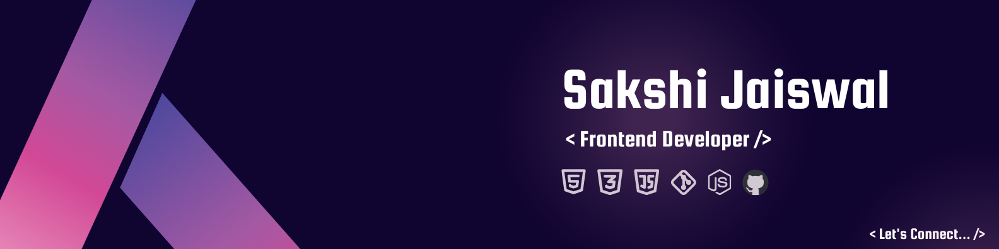

<h1 align="center">Hi 👋, I'm Sakshi Jaiswal</h1>
<h3 align="center">A passionate programmer from India</h3>

  I’m a web developer👩🏻‍💻 and technology enthusiast with a deep-seated passion for crafting intricate user interfaces that are not only visually appealing🤩 but also functionally sophisticated.I take pride in my ability to transform complex design challenges into seamless and intuitive web experiences.

  

- 🌱 I’m currently learning **React and ExpressJs**

- 💬 Ask me about **Javascript, CSS, NodeJS**

- 🧐 I'm looking to **collaborate on projects** that are using **JavaScript and React**

- 👩🏻‍💻 As a geek, I like to follow **technological trends**

- **Fun Fact 😜:** The thrill of turning a concept into a fully-functional website is what drives me day in and day out.

## 💻 Tech Stack:

<h2 align="left">👩🏻‍💻 Most used Language:</h2>

<h2 align="left">📈 Activity:</h2>

  

