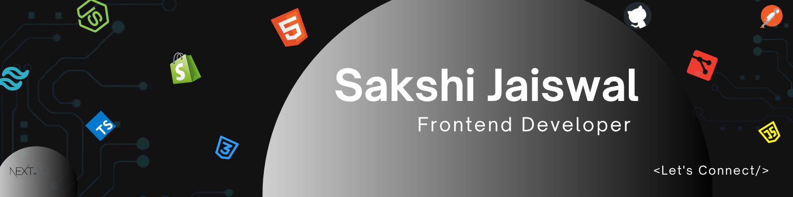

<h1 align="center">Hi , I'm Sakshi Jaiswal</h1>

I’m a FullStack Engineer from India who loves turning ideas into 𝐜𝐥𝐞𝐚𝐧, 𝐟𝐚𝐬𝐭, 𝐚𝐧𝐝 𝐞𝐧𝐠𝐚𝐠𝐢𝐧𝐠 web experiences.  
I care about the little details, design that feels right, code that runs smooth, and projects that just work. I enjoy solving real problems, learning new things, and building cool stuff with people who share the same energy.

  

- 🌱 Currently diving into **Next.js** & **TypeScript**
- 💬 Let’s talk **React**, **Tailwind**, **JavaScript**, **CSS**, or **Node.js**  
- 🤝 Open to collaborating on **MERN stack** projects  
- 🧠 Always curious about what’s next in tech
- 🎧 Surviving on **code, caffeine, and playlists**
- 🐢 **Fun fact**: I start slow, but once I get going, I don’t stop

## 💻 Tech Stack:

<h2 align="left">🔥 Streaks:</h2>

  

## 🏆 GitHub Trophies:

  <a href="https://github.com/thesakshijaiswal">
    <picture>
      <source media="(prefers-color-scheme: dark)" srcset="https://github-profile-trophy-ruddy.vercel.app/?username=thesakshijaiswal&no-bg=true&row=2&column=8&margin-w=20&margin-h=20&theme=monokai">
      <source media="(prefers-color-scheme: light)" srcset="https://github-profile-trophy-ruddy.vercel.app/?username=thesakshijaiswal&no-bg=true&row=2&column=8&margin-w=20&margin-h=20">
      
    </picture>
  </a>

<h2 align="left">👩🏻‍💻 Most used Language:</h2>

<h2 align="left">📈 Activity:</h2>

  

